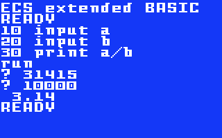

# ECS extended BASIC

## by Oscar Toledo G. https://nanochess.org/

### (c) Copyright 2025 Oscar Toledo G.

This a BASIC language for the Intellivision Entertainment Computer System. I intend to make it as a (better) replacement for the incredibly slow and limited Intellivision ECS BASIC.

I wrote an article in two parts about its development, you can read [part1 here](https://nanochess.org/ecs_basic.html), [part2 here](https://nanochess.org/ecs_basic_2.html), and an [Atariage thread](https://forums.atariage.com/topic/384664-typing-basic-on-my-ecs/)

It is written in CP1610 assembler language, and it has been tested both in emulation and with real hardware.

For example, this program runs in 15 seconds (modified from a benchmark by carlsson):

The same program for the Mattel ECS BASIC takes 210 seconds:

The PRINT of the benchmark exists only to stop your chronometer, because all these multiplications exceed the limits of the floating-point format.

There are 26 variables (A-Z), 26 string variables (A$-Z$), and 26 unidimensional arrays (A-Z) requiring DIM first to declare them.

The floating-point support is 32 bits (25-bit mantissa, 7-bit exponent, and sign bit). Number input and output support scientific notation.

The following statements are supported:
    
    LIST
    LIST line
    LIST line-
    LIST line-line
    LLIST
    RUN
    RUN line
    NEW
    LOAD "file"
    SAVE "file"
    VERIFY "file"
    REM comment
    DIM a(length)
    DIM a(length),b(length)
    v = expr
    IF expr THEN line
    IF expr THEN statement
    IF expr THEN statement ELSE statement
    GOTO line
    STOP
    INPUT v
    INPUT v$
    INPUT a(i)
    INPUT "string";v
    INPUT "string";a(i)
    INPUT "string";v$
    LPRINT
    PRINT expr
    PRINT expr$
    PRINT "string"
    PRINT "string";
    PRINT "string";expr
    PRINT "string";expr$
    PRINT TAB(5);"string"
    PRINT SPC(5);"string"
    PRINT AT 20
    PRINT AT 20;"string"
    GOSUB line
    RETURN
    FOR v=x TO y
    FOR v=x TO y STEP z
    FOR a(i)=x TO y
    NEXT
    NEXT v
    RESTORE
    RESTORE line
    READ v
    READ v,v
    READ a(i)
    READ a$
    READ a$,b$
    DATA n
    DATA n,n
    DATA "string"
    COLOR expr
    SPRITE [0-7],x,y,c
    SOUND 0,[f][,v]
    SOUND 1,[f][,v]
    SOUND 2,[f][,v]
    SOUND 3,[f][,env]
    SOUND 4,[noise][,mix]
    WAIT     
    bk(pos)=card   
    MODE 0,colors
    MODE 1
    BORDER color
    DEFINE card,"hex.drawing"
    POKE addr,expr
    ON expr GOTO line1,line2,line3
    ON expr GOSUB line1,line2,line3
    PLOT x1,y1,color
    DRAW x2,y2,color
    CIRCLE x1,y1,radius,color
    
Statements can be concatenated on a single line using the colon as a separator.

The following expression operators are supported:

    OR
    XOR
    AND
    =
    <>
    <
    >
    <=
    >=
    +
    -
    *
    /
    ^
    -expr
    NOT expr
    (expr)
    num
    v
    a(index)
    INT(expr)
    ABS(expr)
    SGN(expr)
    RND
    STICK(cont)
    STRIG(cont)
    KEY(cont)
    BK(pos)
    PEEK(addr)
    USR(addr)
    ASC(str)
    LEN(str)
    CHR$(expr)
    LEFT$(str,length)
    MID$(str,pos)
    MID$(str,pos,length)
    RIGHT$(str,length)
    VAL(str)
    STR$(expr)
    INKEY$
    INSTR(str1,str2)
    INSTR(pos,str1,str2)
    SIN(expr)
    COS(expr)
    TAN(expr)
    LOG(expr)
    EXP(expr)
    SQR(expr)
    ATN(expr)
    TIMER
    FRE(expr)
    POS(expr)
    LPOS(expr)
    POINT(x,y)
    HEX$(expr)
    
String support allows comparison between strings, string concatenation, and assorted functions. There's no support for arrays of strings nor bidimensional arrays.

If you get an error, you can do debugging of the program by using PRINT to see the variables, and using GOTO to re-enter a program. RUN resets all variables.

Given the slow speed of the CP1610 processor, my interpreter doesn't allow expressions for the target line of GOTO and GOSUB statements.

A small game in this flavor of BASIC:

    10 CLS:REM UFO INVASION. NANOCHESS 2025
    20 DEFINE 0,"183C00FF007E3C000018183C3C7E7E000000183C3C3C3C7EFF2400"
    50 x=96:w=0:v=0:u=0:t=159
    60 SPRITE 0,776+x,344,2061
    70 SPRITE 1,776+v,256+w,2066
    80 SPRITE 2,1796+t,256+u,6149
    90 WAIT:c=STICK(0)
    100 IF c>=3 AND c<=7 THEN IF x<152 THEN x=x+4
    110 IF c>=11 AND c<=15 THEN IF x>0 THEN x=x-4
    120 IF w=0 THEN SOUND 2,,0:IF STRIG(0) THEN v=x:w=88
    130 t=t+5:IF t>=160 THEN t=0:u=INT(RND*32)+8
    140 IF W=0 THEN GOTO 60
    150 SOUND 2,W+20,12:W=W-4
    160 IF ABS(w-u)<8 AND ABS(v-t)<8 THEN t=164:w=0:GOSUB 180
    170 GOTO 60
    180 SOUND 3,8000,9:SOUND 1,2048,48
    190 RETURN

This game can be loaded using the jzintv emulator and the provided _tape_UFO.ecs_ file from the _utils_ directory.
 
## Running the interpreter in real hardware

You can load the ROM in a JLP-Flash cartridge for running the BASIC interpreter on a real Intellivision. You need the Mattel Intellivision ECS, as this peripheral provides the computer keyboard.

If you are using any other Flash cartridge, be sure to enable 16-bit RAM memory in the area $8000-$9fff (8K words). Most cartridges implement it as CC3 memory (Cuttle Cart 3) because it was the first to provide it.

## Cassette support

The LOAD, SAVE, and VERIFY statements are working in emulation and real hardware. Filenames are four characters (just to keep an small compatibility with the ECS tape format, and because the jzintv emulator can separate different files in the main directory)

For real hardware, instead of cassette, you can use a PC computer and connect the "To tape" connector to the Mic input, and the "From tape" connector to the Line Out. I recommend using Audacity to handle the recording and playing. You need to amplify the recorded signal, Audacity chooses automatically the maximum level possible. It is suggested to save your recordings as WAV files.

## Printer support

The LPRINT, and LLIST statements are working in real hardware using a Mattel Aquarius printer. Never tested in emulation, because jzintv has a bug.

If your printer doesn't come with the cable, here is a schematic of how you can build one: https://forums.atariage.com/topic/323929-aquarius-printer-technical-info-and-reverse-engineering/

## More programs

I've started a [thread in Atariage](https://forums.atariage.com/topic/385238-i-set-up-a-game-factory-with-my-ecs/) to publish games made with my interpreter.

* Hangman.
* Lunatic Math.
* Dogfight.
* Spider Invasion.
* Aircraft.
* Parachute.
* Chalice.
* Meteors.
* Road Race.

